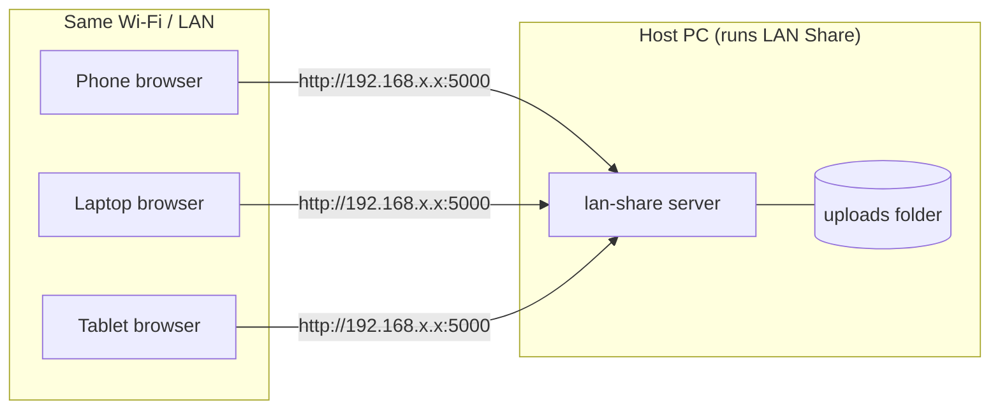
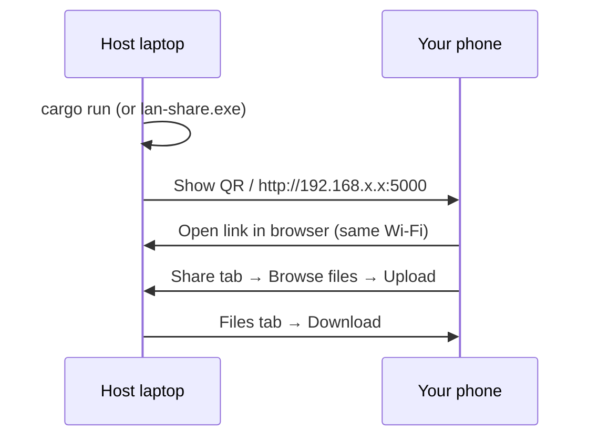

<p align="center">
  <strong>LAN Share</strong><br>
  <sub>Fast, private file transfer on your local network — no cloud, no internet required</sub>
</p>

<p align="center">
  
  
  
  
</p>

---

## What is LAN Share?

**LAN Share** is a lightweight app that turns one computer on your Wi‑Fi into a file server. Everyone on the same network can open a link in their browser, upload files, and download what others shared — phones, laptops, and tablets all work together.

| | |
|---|---|
| **Works offline** | Only your local network is used — no account, no upload to the cloud |
| **Any file type** | Videos, photos, music, PDFs, ZIP archives, installers, and more |
| **Any size** | Large files stream over the LAN (no artificial 2 MB cap) |
| **Cross-device** | Phone ↔ laptop ↔ phone ↔ tablet on the same Wi‑Fi |
| **Simple UI** | QR code, copy link, drag-and-drop, progress bar, device list |

---

## How it works



1. **One device hosts** — usually a laptop or desktop running `lan-share`.
2. **Others join** — they open the **LAN address** (not `localhost`) in Chrome, Safari, Firefox, etc.
3. **Upload** — files are stored in the host’s `uploads/` folder and listed for everyone.
4. **Download** — any connected device can download from the **Files** tab.

> **Important:** `localhost` only works on the host machine. Phones must use the address like `http://192.168.1.12:5000` shown in the terminal or QR code.

---

## Quick start (from source)

### Prerequisites

Install [Rust](https://rustup.rs/) (1.70 or newer):

```bash
curl --proto '=https' --tlsv1.2 -sSf https://sh.rustup.rs | sh   # Linux / macOS
# Windows: https://rustup.rs/ → download rustup-init.exe
```

Verify:

```bash
rustc --version
cargo --version
```

### Run in development

```bash
git clone <your-repo-url>
cd lan-share
cargo run
```

You should see:

```text
LAN Share — share any file on your local network
This device (host): http://localhost:5000
Other devices use: http://192.168.1.12:5000
```

Open **http://localhost:5000** on the host. On other devices, open the **“Other devices use”** URL.

### Run an optimized build

```bash
cargo build --release
./target/release/lan-share          # Linux / macOS
# target\release\lan-share.exe      # Windows
```

---

## Packaging for distribution

The app needs the **`static/`** folder next to the binary (for CSS/JS). The **`uploads/`** folder is created automatically at runtime.

### Option A — Use the packaging script (Linux / macOS)

```bash
chmod +x scripts/package.sh
./scripts/package.sh
```

Output:

```text
dist/lan-share/
├── lan-share          # executable
├── static/
│   ├── app.js
│   └── style.css
├── uploads/           # empty, created for you
├── run.sh             # Linux / macOS launcher
└── README.txt         # short instructions for end users
```

Zip and share `dist/lan-share/` (or rename the folder before zipping).

### Option B — Manual steps (all platforms)

| Step | Command / action |
|------|------------------|
| 1. Build release | `cargo build --release` |
| 2. Create folder | e.g. `lan-share-portable/` |
| 3. Copy binary | From `target/release/` → `lan-share` or `lan-share.exe` |
| 4. Copy UI | Copy entire `static/` directory beside the binary |
| 5. Run | Start the binary **from that folder** (working directory matters) |

### Platform-specific build notes

<table>
<thead>
<tr>
<th>Platform</th>
<th>Build where?</th>
<th>Binary path</th>
<th>Extra notes</th>
</tr>
</thead>
<tbody>
<tr>
<td><strong>Linux</strong></td>
<td>On Linux (or cross-compile)</td>
<td><code>target/release/lan-share</code></td>
<td>If firewall is enabled: <code>sudo ufw allow 5000/tcp</code></td>
</tr>
<tr>
<td><strong>macOS</strong></td>
<td>On Mac (Intel or Apple Silicon)</td>
<td><code>target/release/lan-share</code></td>
<td>First run: allow incoming connections if macOS prompts you</td>
</tr>
<tr>
<td><strong>Windows</strong></td>
<td>On Windows with MSVC tools</td>
<td><code>target\release\lan-share.exe</code></td>
<td>Allow through Windows Defender Firewall when prompted, or add port <strong>5000</strong> inbound</td>
</tr>
</tbody>
</table>

#### Windows packaging (PowerShell)

```powershell
cargo build --release
New-Item -ItemType Directory -Force -Path dist\lan-share
Copy-Item target\release\lan-share.exe dist\lan-share\
Copy-Item -Recurse static dist\lan-share\
New-Item -ItemType Directory -Force -Path dist\lan-share\uploads
# Optional: run scripts\package.ps1 if provided
cd dist\lan-share
.\lan-share.exe
```

#### macOS Apple Silicon vs Intel

Build on the machine you target, or use Rust targets:

```bash
# Apple Silicon (M1/M2/M3)
cargo build --release --target aarch64-apple-darwin

# Intel Mac
cargo build --release --target x86_64-apple-darwin
```

#### Linux cross-compile for Windows (optional)

```bash
rustup target add x86_64-pc-windows-msvc
# Install mingw-w64 or use cargo-xwin / cross
cargo build --release --target x86_64-pc-windows-msvc
```

---

## Using LAN Share on your phone



| Step | What to do |
|------|------------|
| **1** | Start LAN Share on the **computer** (host). |
| **2** | Connect the phone to the **same Wi‑Fi** as the computer. |
| **3** | On the phone browser, open the **LAN URL** from the terminal or scan the **QR code** on the Share tab. |
| **4** | Do **not** use `localhost` or `127.0.0.1` on the phone — it will not work. |
| **5** | Tap **Browse files** or the upload area → pick photos/videos/documents → **Start upload**. |
| **6** | Open the **Files** tab to download what others uploaded. |
| **7** | Open **Devices** to see who is online on the network. |

### Troubleshooting (phone)

| Problem | Fix |
|---------|-----|
| Page won’t load | Same Wi‑Fi? Correct IP? Firewall on host allows port **5000**? |
| Can’t pick files | Use **Browse files** button; refresh the page (hard refresh). |
| No files listed | Upload from Share tab first; tap **Refresh** on Files tab. |
| No other devices | Other devices must open the **same** `http://192.168.x.x:5000` link. |

---

## Using on desktop (host or guest)

| Role | Steps |
|------|--------|
| **Host** | Run `lan-share`, open `http://localhost:5000`, share the LAN link or QR with others. |
| **Guest** | Open the LAN link from the host’s screen in your browser. Upload/download like on phone. |
| **Drag & drop** | On desktop, drag files onto the upload zone, then **Start upload**. |

---

## Project structure

```text
lan-share/
├── src/
│   ├── main.rs           # Server entry, routes
│   ├── routes/           # upload, download, devices, files, network
│   ├── templates/        # HTML shell
│   ├── models.rs
│   └── utils/            # QR, network IP, file helpers
├── static/
│   ├── app.js            # Frontend logic
│   └── style.css         # UI
├── uploads/              # Shared files (created at runtime, gitignored)
├── scripts/
│   ├── package.sh        # Linux / macOS portable bundle
│   └── package.ps1       # Windows portable bundle
├── Cargo.toml
└── README.md
```

---

## Configuration

| Setting | Location | Default |
|---------|----------|---------|
| Port | `src/utils/network.rs` → `PORT` | `5000` |
| Upload directory | `uploads/` (next to binary) | auto-created |
| Device timeout | `src/routes/devices.rs` | ~20 seconds |

To change the port, edit `PORT` in `src/utils/network.rs` and rebuild.

---

## Security notice

LAN Share is designed for **trusted local networks** (home Wi‑Fi, lab LAN). It does **not** use encryption or passwords. Anyone on the same network who knows the URL can access shared files. **Do not expose port 5000 to the public internet** without additional protection.

---

## Contributing — help us improve

Ideas, bug reports, and pull requests are welcome. If you want to make LAN Share better, see **[CONTRIBUTING.md](CONTRIBUTING.md)** for:

- How to set up your dev environment  
- Code style and where to add features  
- **Ideas we’d love help with** (your enhancements welcome)

### Quick ways to contribute

- Improve UI/UX (accessibility, themes, mobile layout)  
- Add optional PIN / room codes for sessions  
- mDNS discovery (`lan-share.local`)  
- Pause/resume uploads, download folders as ZIP  
- Installer (`.msi`, `.dmg`, `.deb`)  
- Translations (i18n)  
- Tests and CI (GitHub Actions)  
- Better docs or video walkthrough  

**Have an idea?** Open an issue titled `Idea: …` or discuss in a PR. We’re happy to review designs before you code.

---

## Tech stack

| Layer | Technology |
|-------|------------|
| Server | [Rust](https://www.rust-lang.org/), [Axum](https://github.com/tokio-rs/axum), [Tokio](https://tokio.rs/) |
| Frontend | Vanilla HTML / CSS / JavaScript |
| QR codes | `qrcode` crate |
| Network IP | `local-ip-address` crate |

---

## GitHub Actions (CI & releases)

| Workflow | Trigger | What it does |
|----------|---------|----------------|
| **[CI](.github/workflows/ci.yml)** | Push / PR to `main` or `master` | Builds on Linux, Windows, and macOS; runs `fmt` and `clippy` |
| **[Release](.github/workflows/release.yml)** | Push a tag `v*` (e.g. `v0.1.0`) | Builds portable `.zip` / `.tar.gz` for all platforms and attaches them to a GitHub Release |

### Publish a release

```bash
git tag v0.1.0
git push origin v0.1.0
```

When the workflow finishes, open **Releases** on GitHub and download:

- `lan-share-linux-x86_64.tar.gz`
- `lan-share-windows-x86_64.zip`
- `lan-share-macos-aarch64.tar.gz` (Apple Silicon Macs)

Extract, keep `static/` next to the binary, and run `run.sh` or `run.bat`.

---

## License

MIT — use freely in personal and commercial projects. See [LICENSE](LICENSE).

---

<p align="center">
  <sub>Built for classrooms, studios, and teams who just need to move files across the room.</sub>
</p>
